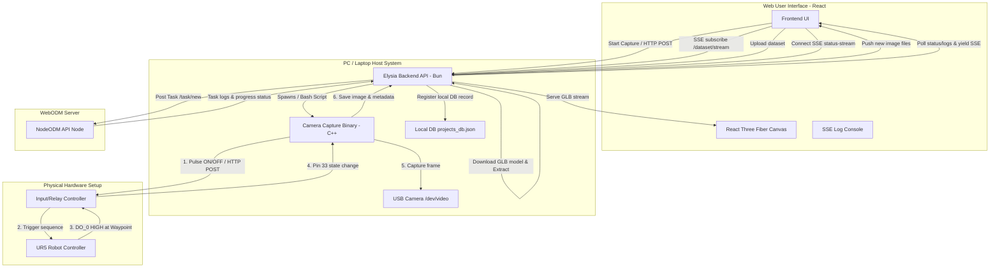

# UR5 Photogrammetry & 3D Reconstruction System

This repository contains the complete hardware-software integration system for automated photogrammetry using a **Universal Robots UR5** robotic arm, an **OpenCV C++ Camera Capture Interface**, a **Bun/Elysia Backend API**, and a **React/Fiber 3D Web User Interface**. 

The system automates the process of moving the UR5 robotic arm through pre-defined waypoints, capturing high-resolution images synchronized via hardware triggers, uploading the captured datasets to a **WebODM / NodeODM** server for 3D photogrammetry processing, and rendering the resulting 3D textured model directly in a web browser.

---

## Table of Contents
1. [System Architecture & Flow](#system-architecture--flow)
2. [Software Components](#software-components)
    - [Camera Interface (C++)](#1-camera-interface-c)
    - [Backend API (Elysia / Bun)](#2-backend-api-elysia--bun)
    - [User Interface (React / Three.js / Fiber)](#3-user-interface-react--threejs--fiber)
3. [Signals and Hardware Contract](#signals-and-hardware-contract)
4. [Environment & Configuration](#environment--configuration)
5. [Installation & Setup](#installation--setup)
    - [Docker Compose Deployment (Recommended)](#docker-compose-deployment-recommended)
    - [Manual Local Installation](#manual-local-installation)
6. [API Endpoints Reference](#api-endpoints-reference)
7. [Web UI & Expected Results](#web-ui--expected-results)
8. [Troubleshooting](#troubleshooting)

---

## System Architecture & Flow

The system employs a decentralized architecture connecting the computer, the UR5 robot controller, and a hardware trigger module (Input/Relay Controller).



### End-to-End Workflow:
1. **Initiation**: The user clicks **Start** in the Web UI.
2. **Camera Initialization & Arming**: The backend API spawns the C++ `ur5_capture` process, which configures the USB camera (`/dev/videoX`) and polls the input controller until trigger Pin 33 is confirmed `LOW` (system armed).
3. **Start Trigger**: The C++ program sends an HTTP POST pulse to the relay controller (`state=on` followed by a `300ms` delay and `state=off`). This physical trigger starts the waypoint sequence program loaded on the UR5 robot.
4. **Synchronized Motion & Capture**:
   - The UR5 moves to a waypoint, halts, and sets Digital Output `DO[0] = HIGH`.
   - The input controller detects the `HIGH` state and exposes it on pin 33.
   - The C++ program, polling `/input` at high speed, detects the rising edge (`0 -> 1`), captures a camera frame via OpenCV, saves it locally as `img_XXXXX.jpg` in a shared volume, and writes metadata to `metadata.jsonl`.
   - The UR5 holds `DO[0] = HIGH` for at least `300-500ms`, then sets `DO[0] = LOW`.
   - The C++ program detects the falling edge (`1 -> 0`), disarms double-trigger protections, and waits for the next waypoint.
5. **Real-time Gallery Feed**: As new images are written to the dataset directory, the backend's Server-Sent Events (SSE) watcher pushes the filenames to the React Web UI, rendering them in a live gallery.
6. **WebODM Processing**: Once capture is complete, the user navigates to the upload page. The Web UI loads the local images directory, authenticates with the WebODM/NodeODM backend, uploads the images, and creates a photogrammetry task.
7. **Progress Stream & Render**: The Web UI streams the processing terminal logs from NodeODM in real time using SSE. When the task is complete, the Web UI automatically downloads, caches, extracts, and streams the reconstructed `.glb` 3D textured model into a web-based Canvas.

---

## Software Components

### 1. Camera Interface (`camera_interface`)
A performance-oriented C++ application built to manage hardware timing and OpenCV-based image capture without overhead.
* **Core Logic ([CaptureController.cpp](./camera_interface/src/CaptureController.cpp))**: Coordinates HTTP polling loop, edge-trigger checks, metadata file writes, and camera frame buffering.
* **Camera Capture ([CameraCapture.cpp](./camera_interface/src/CameraCapture.cpp))**: Configures resolution ($1280 \times 720$), sets video stream encoding format to `MJPG` for USB hardware compatibility, and implements camera warm-up (30 discard frames).
* **Parser & Client**: Parses input pin JSON arrays using `nlohmann/json` and sends HTTP calls with `libcurl`.
* **Execution Script ([run_capture.sh](./camera_interface/scripts/run_capture.sh))**: Sources environment configuration and passes settings directly to the binary as command-line arguments.

### 2. Backend API (`backend_api`)
An asynchronous Elysia/Bun server running on port `<backend_port>` that handles system orchestrations.
* **Camera Controllers ([camera.controller.ts](./backend_api/src/controllers/camera.controller.ts))**: Wraps starting and stopping of the C++ capture process. Implements `/camera/dataset/stream` using an SSE stream that watches the target directory for new image creations via Node filesystem watchers (`fs.watch`).
* **WebODM Integration ([webodm.service.ts](./backend_api/src/services/webodm.service.ts))**: 
  - Authenticates with NodeODM server.
  - Manages WebODM projects and maps them in a local JSON database file (`projects_db.json`).
  - Streams task terminal output and statuses down to the client using custom async generators.
  - Automatically fetches the finished `all.zip` export archive from NodeODM, extracts it, searches for the textured `.glb` file, and streams it back to the client while keeping a local cache.

### 3. User Interface (`user_interface`)
A modern single-page React app served on port `<frontend_port>` via Bun.
* **Main App ([App.tsx](./user_interface/src/App.tsx))**: Manages application state and page routing ("camera", "upload", "viewer").
* **Camera Control Page ([CameraPage.tsx](./user_interface/src/pages/CameraPage.tsx))**: Operates live webcam previews, capture startup, and mounts the live image stream viewer with an expandable full-screen lightbox.
* **Upload Page ([UploadPage.tsx](./user_interface/src/pages/UploadPage.tsx))**: Lists captured images from the local filesystem container volume, structures the WebODM request payload, and transmits image binaries.
* **3D Viewer Page ([ViewerPage.tsx](./user_interface/src/pages/ViewerPage.tsx))**: Embeds a Three.js-based `@react-three/fiber` 3D Canvas equipped with lighting, stage shadows, and trackball rotation controls. Contains the real-time logging panel displaying active terminal output from the NodeODM photogrammetry engine.

---

## Signals and Hardware Contract

### 1. Relay Trigger Pulse (PC $\rightarrow$ UR5)
To begin the sequence, the C++ program issues a pulse to the relay controller using an HTTP POST request:
```http
POST /relay/0
Host: <relay_controller_ip>
Content-Type: application/x-www-form-urlencoded

state=on
```
After a **300 ms** delay, the program shuts down the signal:
```http
POST /relay/0
Host: <relay_controller_ip>
Content-Type: application/x-www-form-urlencoded

state=off
```
This pulse closes the dry contact on the UR5 input terminal board configured to trigger the execution of the waypoint program.

### 2. Capture Trigger (UR5 $\rightarrow$ PC)
The C++ program reads pin levels by sending GET queries to the input controller:
```http
GET http://<relay_controller_ip>/input
```
**Response Format:**
```json
{
  "inputs": [
    { "pin": 25, "state": 0 },
    { "pin": 33, "state": 0 },
    { "pin": 32, "state": 0 }
  ]
}
```
**Waypoint Execution Timing Contract (UR5 Program):**
```text
Move to Waypoint [i]
Wait until robot is fully stable (prevents motion blur)
Set DO[0] = HIGH (triggers C++ program)
Wait 500 ms (guarantees HTTP polling detection)
Set DO[0] = LOW
Wait 500 ms (prevents double-triggering)
Move to Waypoint [i+1]
```

**Rising Edge Detection Logic:**
* A capture is triggered *only* when pin 33 transits from `0` to `1`.
* Continuous `1` states do not trigger extra captures.
* The system waits until the pin falls to `0` before arming the next edge trigger.

---

## Environment & Configuration

Environment settings are consolidated in the [`.env`](./.env) file located in the root workspace.

| Variable | Scope | Description | Placeholder / Format |
| :--- | :--- | :--- | :--- |
| **`BUN_PUBLIC_INPUT_URL`** | Frontend | HTTP input endpoint of the trigger controller | `http://<relay_controller_ip>/input` |
| **`BUN_PUBLIC_RELAY_BASE_URL`** | Frontend | Base HTTP endpoint of the relay controller | `http://<relay_controller_ip>/relay` |
| **`BUN_PUBLIC_BE_BASE_URI`** | Frontend | HTTP base URI of the Elysia backend | `http://<backend_host>:<backend_port>` |
| **`BUN_PUBLIC_USERNAME`** | Frontend | Username used for authenticating with WebODM | `<webodm_username>` |
| **`BUN_PUBLIC_PASS`** | Frontend | Password used for authenticating with WebODM | `<webodm_password>` |
| **`BUN_PUBLIC_DEFAULT_PROJECT_NAME`**| Frontend | Default project name folder in the UI | `PersepsiRobot` |
| **`BUN_PUBLIC_DEFAULT_DATASET_DIR`** | Frontend | Directory path inside container containing dataset | `/dataset_volume/dataset` |
| **`NODEODM_URI_BASE`** | Backend | URL to reach the NodeODM processing server | `http://<nodeodm_server_ip>:<nodeodm_port>` |
| **`WEBODM_URI_BASE`** | Backend | Alternative host address for WebODM manager | `http://<webodm_host>:<webodm_port>` |
| **`CORS_ORIGIN`** | Backend | CORS policy origin allowed access | `http://<frontend_host>:<frontend_port>` |
| **`INPUT_URL`** | C++ Interface| Polling endpoint for checking pin states | `http://<relay_controller_ip>/input` |
| **`START_RELAY_URL`** | C++ Interface| Target relay URL for sequence activation | `http://<relay_controller_ip>/relay/0` |
| **`DATASET_DIR`** | C++ Interface| Filesystem output directory for captures | `/app/dataset_volume/dataset` |
| **`PHOTO_TRIGGER_PIN`** | C++ Interface| Pin number mapped to UR5 DO[0] pulse | `33` |
| **`CAMERA_PATH`** | C++ Interface| USB camera device path file | `/dev/video2` |
| **`MAX_CAPTURES`** | C++ Interface| Maximum camera frames to capture in a run | `20` |
| **`BUILD_DIR`** | C++ Interface| Target output path folder for C++ compiler | `build` |
| **`EXECUTABLE_NAME`** | C++ Interface| Executable file name generated | `ur5_capture` |

---

## Installation & Setup

### Docker Compose Deployment (Recommended)
Using Docker Compose eliminates manual dependency management by setting up pre-compiled containers for Elysia and React, complete with camera path mappings and shared volumes.

1. Ensure the camera device is connected (e.g. `/dev/video2`). Confirm path using:
   ```bash
   ls /dev/video*
   ```
2. Configure settings inside the [`.env`](./.env) file in the root directory.
3. Build and launch the containers:
   ```bash
   docker compose up --build
   ```
4. Access the web interface at: **`http://<frontend_host>:<frontend_port>`**

*Note: The containers mount a shared volume (`ur5photogrammetry_volume`) which acts as the exchange folder for datasets and raw images.*

---

### Manual Local Installation
If you prefer running services directly on your host system:

#### 1. Compile C++ Camera Interface
Install prerequisites (OpenCV, libcurl, nlohmann-json):
```bash
cd camera_interface
chmod +x scripts/install_deps.sh scripts/build.sh scripts/run_capture.sh
./scripts/install_deps.sh
```
Compile the C++ source:
```bash
./scripts/build.sh
```
This builds the binary to `camera_interface/build/ur5_capture`.

#### 2. Start Bun Backend
Install backend dependencies and run the server:
```bash
cd ../backend_api
bun install
bun run src/index.ts
```
The backend starts listening on port `<backend_port>`.

#### 3. Start Frontend User Interface
Install frontend dependencies and start the local development server:
```bash
cd ../user_interface
bun install
bun run dev
```
The frontend starts listening on port `<frontend_port>`.

*Note: You can also use the helper scripts in the root directory: [`1-start-be.sh`](./1-start-be.sh) and [`2-start-interface.sh`](./2-start-interface.sh).*

---

## API Endpoints Reference

### 1. Camera Control Endpoints
* **`POST /api/camera/start`**
  - Spawns the background process running `run_capture.sh` to trigger the UR5 robot and begin photo capture.
  - *Response (200)*: `{ "message": "Camera capture started", "pid": 1234 }`
* **`POST /api/camera/stop`**
  - Terminates the running camera capture C++ sub-process.
  - *Response (200)*: `{ "message": "Camera capture stopped" }`
* **`GET /api/camera/dataset`**
  - Lists the filenames of all images captured and saved in the dataset directory.
  - *Response (200)*: `{ "images": ["img_00001.jpg", "img_00002.jpg"] }`
* **`GET /api/camera/dataset/:filename`**
  - Serves the specific raw image file binary from the dataset.
* **`GET /api/camera/dataset/stream`**
  - Sets up a persistent Server-Sent Events (SSE) connection that pushes the filename of new images as they are saved to disk in real-time.

### 2. WebODM / Task Endpoints
* **`POST /api/auth/token-auth/`**
  - Retrieves a session token from NodeODM using the credentials stored in variables.
  - *Response (200)*: `{ "token": "jwt-token-string" }`
* **`GET /api/project/`**
  - Retrieves information about a project using the project name query parameter.
* **`POST /api/project/`**
  - Registers a new project in the local registry.
* **`GET /api/project/:projectId/tasks`**
  - Queries NodeODM for the list of tasks belonging to a project.
* **`POST /api/task`**
  - Uploads a list of image files to NodeODM and registers a task with custom processing configurations.
* **`GET /api/task/:projectId/:taskId/model`**
  - Streams the compiled `.glb` textured model file. If not cached, the backend automatically downloads the task ZIP archive, extracts it, and serves it.
* **`GET /api/task/:projectId/:taskId/status-stream`**
  - Establishes a Server-Sent Events (SSE) log stream that reads the current task processing status and yields output console logs.

---

## Web UI & Expected Results

### Web User Interface

*Below is a visual representation of the React photogrammetry interface showing camera control state, active capture gallery, and live stream console.*


---

### Expected Photogrammetry 3D Reconstruction Result

*Below is a visual showing the expected outcome of the processed waypoints reconstruction into a high-density 3D textured mesh.*


---

## Troubleshooting

### 1. OpenCV Camera Path Failures
* **Symptom**: `[ERROR] Failed to open camera with V4L2 backend` or `[WARN] Empty camera frame`
* **Fixes**:
  - Identify the correct path to the video device using `v4l2-ctl --list-devices`.
  - Ensure the user running the process belongs to the user group:
    ```bash
    sudo usermod -aG video $USER
    ```
  - If running in Docker, verify that the `CAMERA_PATH` environment variable matches the device path, and that it is mapped under `devices` in `docker-compose.yml`.

### 2. Waypoint Polling Misses Trigger Pulses
* **Symptom**: The UR5 robot completes waypoints but images are not captured.
* **Fixes**:
  - Check the output of the input controller directly:
    ```bash
    watch -n 0.1 'curl -s http://<relay_controller_ip>/input'
    ```
  - Verify that the `PHOTO_TRIGGER_PIN` variable is correctly set to `33` (or the input pin wired to the robot DO).
  - Increase the waypoint hold time on the UR5 script program to at least `500 ms` to guarantee that HTTP polling picks up the state transition.